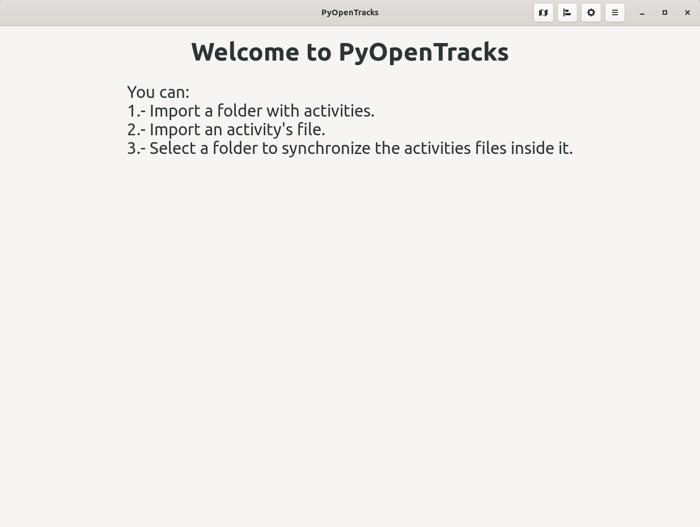
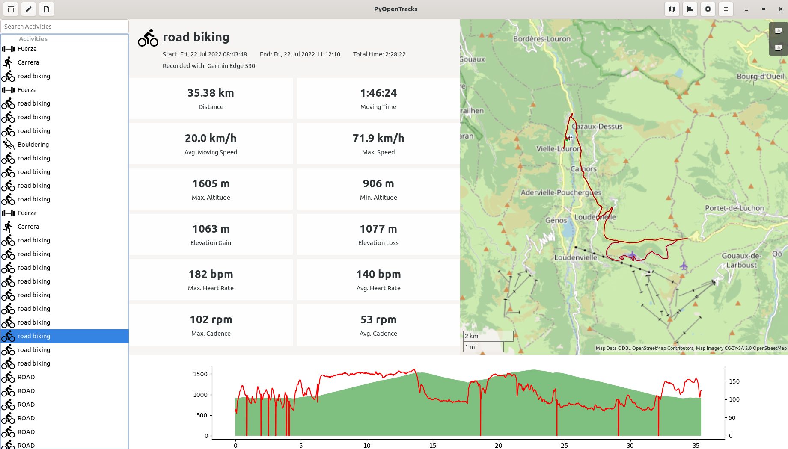
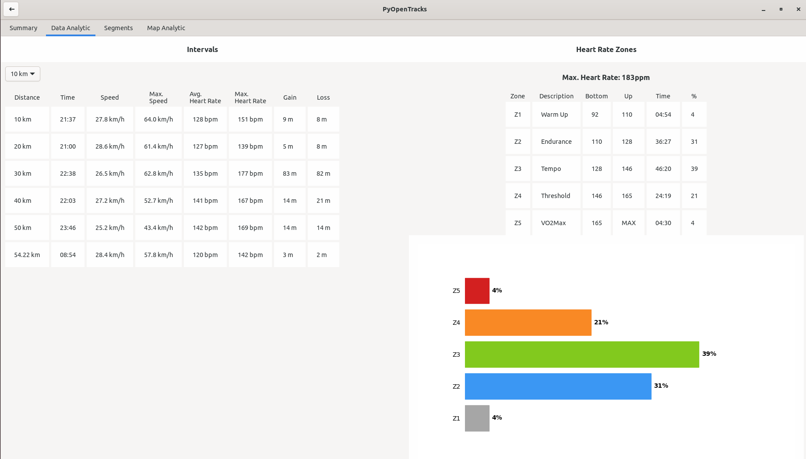
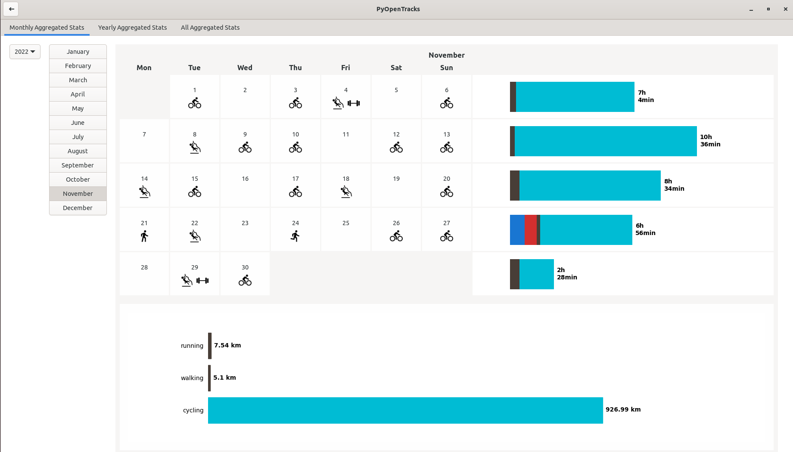
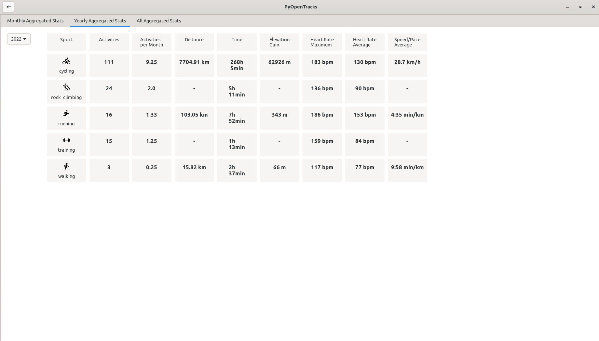

# PyOpenTracks
PyOpenTracks is a GTK/GNOME libre-software analytic project for activities
(like biking, running, etc) recorded with applications like 
[OpenTracks](https://github.com/OpenTracksApp/OpenTracks) and exported to GPX or
FIT.

In fact, this project is created with the goal of analyse the tracks I record
with [OpenTracks](https://github.com/OpenTracksApp/OpenTracks), exported to GPX
and synchronized through [NextCloud](https://nextcloud.com/).

It's a hobby project and at this moment it's in an active development status,
so it shouldn't be used for real purpose.

# Current features
This project is in an early stage so the current features are growing little by
little.

In the next sections you have the options PyOpenTracks offers to you.

## Import your activities
You can import and save your activities by GPX and FIT files:

- For GPX files: they have to contain location information (latitude and
longitude points) with time.
- For FIT files, PyOpenTracks can import these activities/sports: running,
cycling, walking, hiking, e_biking, motorcycling, driving, inline_skating,
ice_skating, training and rock_climbing.

## Auto-import
PyOpenTracks can auto-import files you save in a folder. PyOpenTracks will
look for new activities in the folder you selected for importing new ones.

It's an experimental feature.

## Export your activities
At this moment you can export all your activities to GPX format.

## Export your segments
At this moment you can export your segments to FIT format.

## Open files
PyOpenTracks can open GPX and FIT files. When you open an activity then it 
won't be saved.

## Analytic
You can see analytic information about your imported activities like:

- Start and end time.
- Total and moving time.
- Distance.
- Speed: average and maximum.
- Heart rate: average and maximum.
- Cadence: average and maximum.
- Elevation: minimum and maximum.
- Elevation gain and loss.
- Temperature: average, minimum and maximum.
- Calories consumed.
- Heart rate zones information: time and percentage in every zone with graphs.
- Information about segments you move on (you have to create segments firstly).
- See stats in selected segments for an activity.

Also, if your activity is a "moving activity" then PyOpenTracks will show you
the track on a map ([OpenStreetMap](https://www.openstreetmap.org)).

<table>
<tr>
<td>

</td>
<td>

</td>
</tr>
</table>

## Aggregated statistics
PyOpenTracks shows you monthly, yearly and totals stats from all your 
activities per category.

<table>
<tr>
<td>

</td>
<td>

</td>
</tr>
</table>

## Segments analyzing
You can create segments from activities you imported and PyOpenTracks shows you
stats and information about these segments in the activities you imported.

# Develop, test, use, check it out...
If you want to check PyOpenTracks out, participate in the development... you can read [DEVELOPMENT.md](DEVELOPMENT.md) to has PyOpenTracks ready to execute and use.

# Name story
The name of this project is based on [OpenTracks](https://github.com/OpenTracksApp/OpenTracks) that is the app I use to record all my activities and the source of all my GPX
files.

